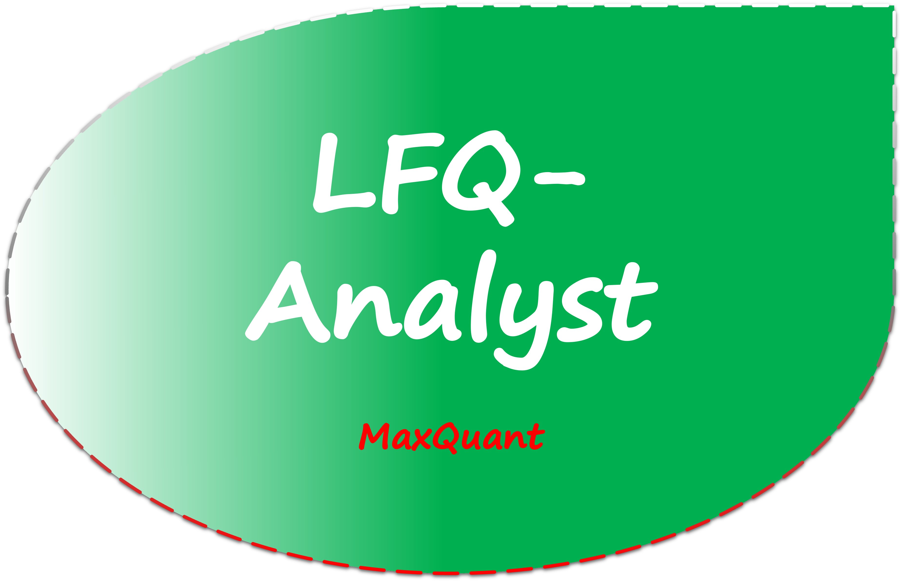
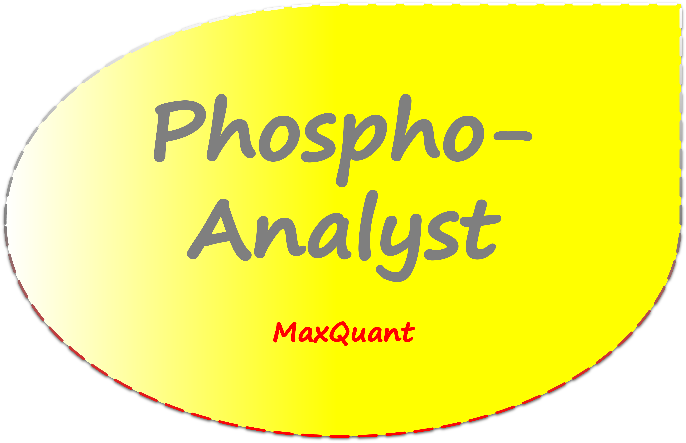
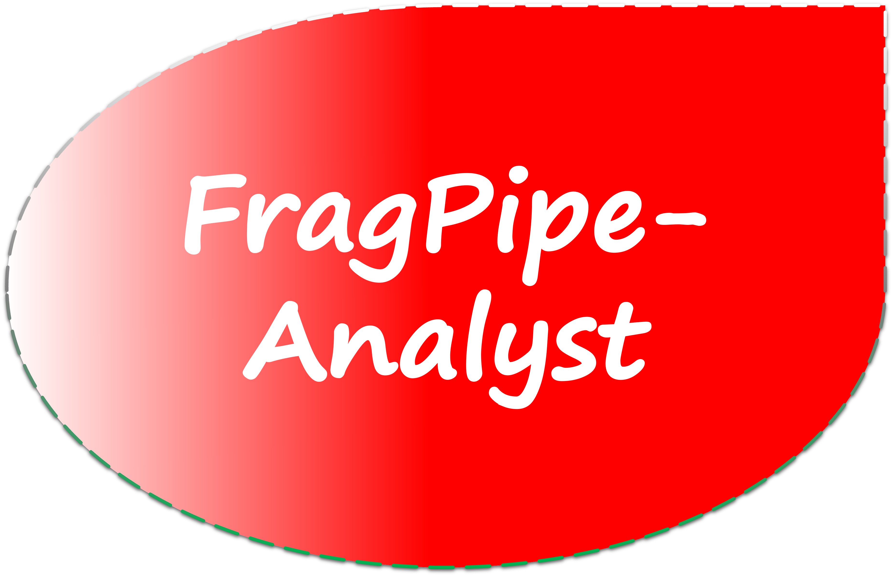

<!--
---
title: Web-Applications for MS Proteomics
subtitle: This platform directs you to the right tools required for analysing and visualising mass spectrometry (MS)-based pre-processed proteomics data.
output: html_document
---
-->

<!-- Start HTML part -------------------------------------------------------------------------------------------------------------------------- -->
<!-- Start Header and About part -------------------------------------------------------------------------------------------------------------- -->

<nav>
<ul>
  <li><a class="active" href="index.html">Home</a></li>
  <li><a href="about.html">About</a></li>
</ul>
</nav>

  
Proteomic Analyst Suites

  

A Compilation of Easy-To-Use Web Applications for
 
Proteomic Data Analysis and Visualisation
  

Powered by <a href="https://www.monash.edu/researchinfrastructure/mpmf">MPMF </a>and <a href="https://www.monash.edu/researchinfrastructure/bioinformatics">MBP</a>

     

<!-- Start Body part ------------------------------------------------------------------------------------------------------------------------ -->
<!-- 1. LFQ-Analyst -->

  

  <h2 class="project-text">
  <!-- <a href="http://118.138.235.40:3838/LFQ-Analyst_Fragpipe/" style="color:#0f293c">LFQ-Analyst<h4>(MaxQuant)</h4></a> -->
  
  </h2>
  

  

  
     Fully automated downstream statistical analysis and visualisation tool for *label-free* quantitative proteomic data pre-processed with **MaxQuant**.
     
  For more information, please see our publication at [ACS Publications](https://pubs.acs.org/doi/10.1021/acs.jproteome.9b00496).  
  

  

  

  

<!-- 2. FragPipe-Analyst -->

  

  <h2 class="project-text">
  <!-- <a href="http://118.138.235.40:3838/PhosphoAnalyst/" style="color:#0f293c" >Phospho-Analyst</a> -->
  
  </h2>
  

  
    Fully automated downstream statistical analysis and visualisation tool for *phosphoproteomic* datasets pre-processed with MaxQuant.   
  

  

  

<!-- 3. FragPipe-Analyst -->

  

  <h2 class="project-text">
  <!-- <a href="http://118.138.235.40:3838/LFQ-Analyst_Fragpipe/" style="color:#0f293c" >FragPipe-Analyst</a> -->
  
  </h2>
  

  
    Recommended downstream statistical analysis and visualisation tool for proteomic data pre-processed with *FragPipe* and other selected software packages developed in the [Nesvizhskii Lab](https://fragpipe.nesvilab.org/).   
  

  

  

<!-- 4. DIA-Analyst -->

  

  <h2 class="project-text">
  
  </h2>
  

  
    DIA-Analyst is under development and will be released soon.   
  

  

  

<!-- 5. TMT-Analyst -->

  

  <h2 class="project-text">
  
  </h2>
  

  
    TMT-Analyst is under development and will be released soon.   
  

  

  

<!-- Start footer part ------------------------------------------------------------------------------------------------------------------- -->
<!-- Feedback -->

 For any feedback or issues regarding the apps, please reach out on our <a href="https://github.com/MonashProteomics/" >GitHub</a>. 

<!-- End HTML part ------------------------------------------------------------------------------------------------------------------------ -->
